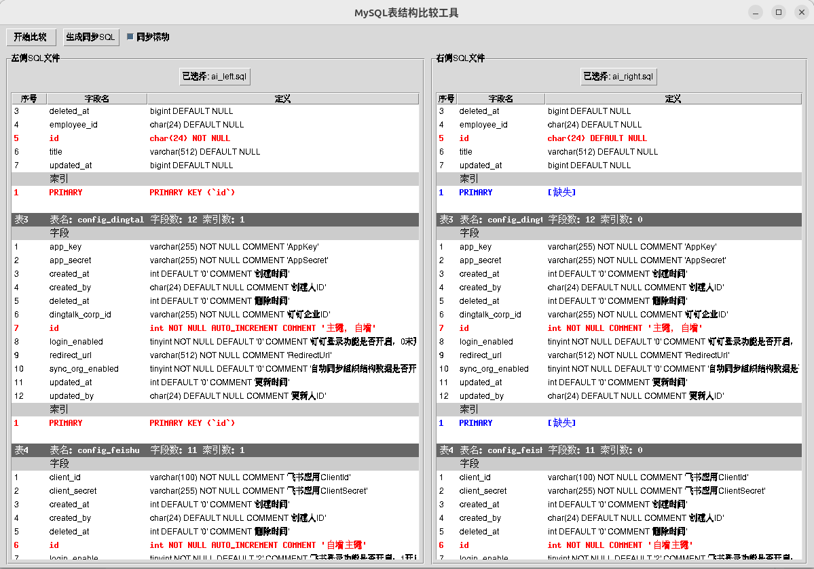

# MySQL表结构比较工具

这是一个用Python编写的GUI工具，用于比较两个MySQL数据库的表结构差异。



## 功能特点

1. 支持选择两个SQL文件进行比较
2. 可视化显示表结构差异
3. 自动生成同步SQL语句
4. 多线程处理，防止界面卡死

## 安装要求

- Python 3.6+
- tkinter (Python标准库)
- mysql-connector-python

## 安装步骤

1. 克隆或下载本项目
2. 安装依赖：
```bash
pip install -r requirements.txt
```

## 使用方法

1. 运行程序：
```bash
python main.py
```

2. 在界面左右两侧分别选择要比较的SQL文件
3. 点击"开始比较"按钮进行表结构比较
4. 点击"生成同步SQL"按钮生成同步SQL语句

## 注意事项

- SQL文件必须是有效的MySQL表结构导出文件
- 建议在生成同步SQL后，仔细检查SQL语句的正确性
- 执行同步SQL前请确保已备份数据库 