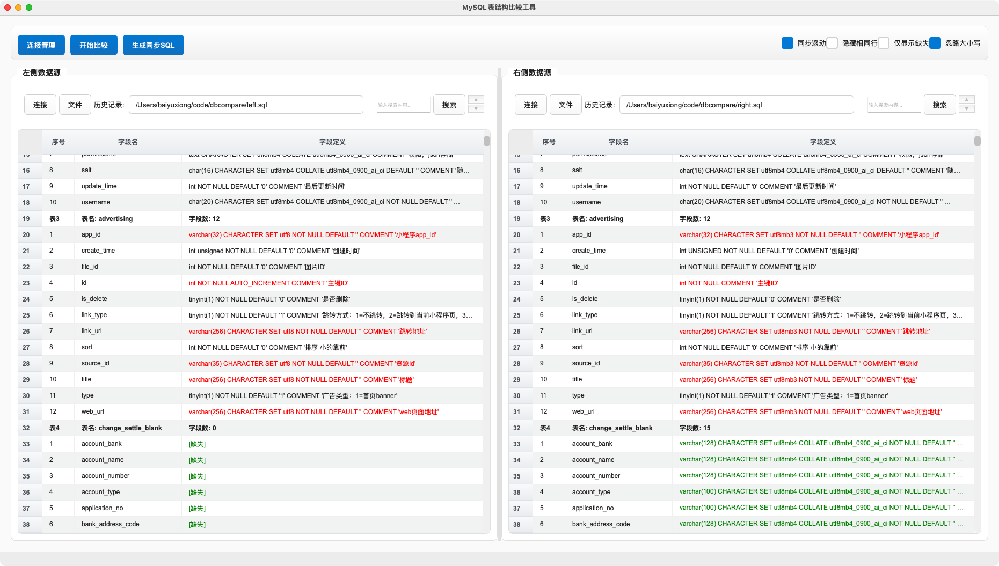

# DBCompare - MySQL表结构比较工具

[English](#english) | [中文](#chinese)

---

## English

A graphical tool for comparing MySQL database table structures, supporting both file import and database connection methods.



### Features

- 🔍 **Table Structure Comparison**: Compare table structure differences between two data sources
- 📁 **File Support**: Import SQL files for analysis
- 🗄️ **Database Connection**: Direct connection to MySQL databases
- 🔄 **Sync SQL Generation**: Automatically generate SQL statements for synchronizing table structures
- 📊 **Visual Interface**: Intuitive difference display interface
- 🔗 **Connection Management**: Save and manage database connection information
- 📜 **History Records**: Record used data sources
- 🌍 **Internationalization**: Support for Chinese and English interface switching

### Requirements

- Python 3.7+
- PyQt6
- MySQL Connector/Python
- sqlparse

### Installation

#### Install Dependencies

```bash
pip install -r requirements.txt
```

#### Run the Application

```bash
python app.py
```

#### Development Installation

```bash
pip install -e .
```

### Usage

1. **Start the Application**: Run `python app.py`
2. **Select Data Sources**: 
   - Click "Connect" button to connect to database
   - Click "File" button to select SQL file
3. **Start Comparison**: After selecting two data sources, click "Start Comparison"
4. **View Differences**: The application will display table structure differences
5. **Generate Sync SQL**: Click "Generate Sync SQL" to get synchronization statements
6. **Language Settings**: Switch interface language via "Settings" -> "Language Settings"

### Development

#### Build the Application

```bash
# Quick build (recommended)
python build.py

# Platform-specific build
bash scripts/build_macos.py    # macOS
bash scripts/build_linux.py    # Linux
python scripts/build_windows.py # Windows
```

### Project Structure

```
dbcompare/
├── src/                    # Source code directory
│   ├── core/              # Core functionality modules
│   │   ├── sql_parser.py      # SQL parser
│   │   ├── sql_generator.py   # SQL generator
│   │   └── db_connector.py    # Database connector
│   ├── ui/                # User interface modules
│   │   ├── connection_dialog.py # Connection management dialog
│   │   └── language_dialog.py  # Language settings dialog
│   ├── data/              # Data models and storage
│   │   └── models.py          # Data model definitions
│   ├── i18n/              # Internationalization module
│   │   ├── i18n_manager.py    # Internationalization manager
│   │   ├── zh_CN.json         # Chinese translation file
│   │   └── en_US.json         # English translation file
│   ├── utils/             # Utility functions
│   │   └── util.py            # Common utility functions
│   └── main.py            # Main application
├── scripts/               # Build and deployment scripts
├── config/                # Configuration files
├── app.py                 # Application entry point
├── requirements.txt       # Dependency package list
├── setup.py              # Installation configuration
├── pyproject.toml        # Project configuration
└── README.md             # Project description
```

### License

MIT License

### Contributing

Welcome to submit Issues and Pull Requests!

---

## Chinese

一个用于比较MySQL数据库表结构的图形化工具，支持文件导入和数据库连接两种方式。


### 功能特性

- 🔍 **表结构比较**: 比较两个数据源的表结构差异
- 📁 **文件支持**: 支持导入SQL文件进行分析
- 🗄️ **数据库连接**: 支持直接连接MySQL数据库
- 🔄 **同步SQL生成**: 自动生成同步表结构的SQL语句
- 📊 **可视化界面**: 直观的差异显示界面
- 🔗 **连接管理**: 保存和管理数据库连接信息
- 📜 **历史记录**: 记录使用过的数据源
- 🌍 **国际化支持**: 支持中英文界面切换

### 环境要求

- Python 3.7+
- PyQt6
- MySQL Connector/Python
- sqlparse

### 安装和运行

#### 安装依赖

```bash
pip install -r requirements.txt
```

#### 运行程序

```bash
python app.py
```

#### 开发安装

```bash
pip install -e .
```

### 使用方法

1. **启动程序**: 运行 `python app.py`
2. **选择数据源**: 
   - 点击"连接"按钮连接数据库
   - 点击"文件"按钮选择SQL文件
3. **开始比较**: 选择两个数据源后点击"开始比较"
4. **查看差异**: 程序会显示表结构的差异
5. **生成同步SQL**: 点击"生成同步SQL"获取同步语句
6. **语言设置**: 通过"设置" -> "语言设置"切换界面语言

### 开发

#### 构建应用程序

```bash
# 快速构建（推荐）
python build.py

# 平台特定构建
python scripts/build_macos.py    # macOS
python scripts/build_linux.py    # Linux
python scripts/build_windows.py  # Windows
```

### 项目结构

```
dbcompare/
├── src/                    # 源代码目录
│   ├── core/              # 核心功能模块
│   │   ├── sql_parser.py      # SQL解析器
│   │   ├── sql_generator.py   # SQL生成器
│   │   └── db_connector.py    # 数据库连接器
│   ├── ui/                # 用户界面模块
│   │   ├── connection_dialog.py # 连接管理对话框
│   │   └── language_dialog.py  # 语言设置对话框
│   ├── data/              # 数据模型和存储
│   │   └── models.py          # 数据模型定义
│   ├── i18n/              # 国际化模块
│   │   ├── i18n_manager.py    # 国际化管理器
│   │   ├── zh_CN.json         # 中文翻译文件
│   │   └── en_US.json         # 英文翻译文件
│   ├── utils/             # 工具函数
│   │   └── util.py            # 通用工具函数
│   └── main.py            # 主应用程序
├── scripts/               # 构建和部署脚本
├── config/                # 配置文件
├── app.py                 # 应用程序入口
├── requirements.txt       # 依赖包列表
├── setup.py              # 安装配置
├── pyproject.toml        # 项目配置
└── README.md             # 项目说明
```

### 许可证

MIT License

### 贡献

欢迎提交Issue和Pull Request！ 